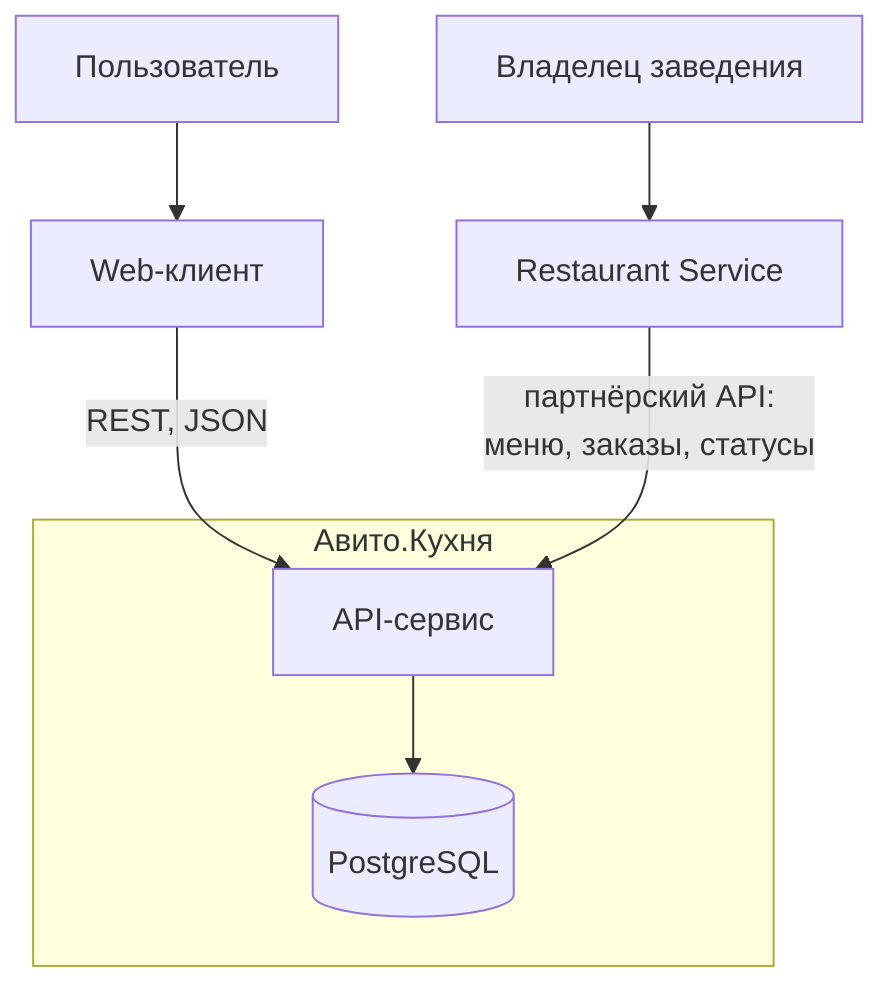

## Архитектура (C4, Level 2)

```mermaid
flowchart TB
    User["Пользователь"]
    Owner["Владелец заведения"]

    Client["Web-клиент"]
    RS["Restaurant Service"]

    subgraph Kitchen ["Авито.Кухня"]
        API["API-сервис"]
        DB[("PostgreSQL")]
    end

    User --> Client
    Client -->|"REST, JSON"| API
    API --> DB
    Owner --> RS
    RS -->|"партнёрский API:<br/>меню, заказы, статусы"| API
```
