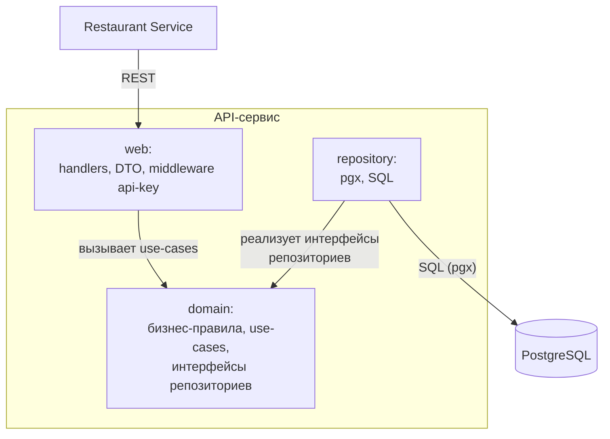

## Архитектура (C4, Level 3)

```mermaid
flowchart TB
    subgraph API ["API-сервис"]
        WEB["web:<br/>handlers, DTO, middleware api-key"]
        DOM["domain:<br/>бизнес-правила, use-cases,<br/>интерфейсы репозиториев"]
        REPO["repository:<br/>pgx, SQL"]
    end
    DB[("PostgreSQL")]
    RS["Restaurant Service"]

    RS -->|"REST"| WEB
    WEB -->|"вызывает use-cases"| DOM
    REPO -->|"реализует интерфейсы<br/>репозиториев"| DOM
    REPO -->|"SQL (pgx)"| DB
```
