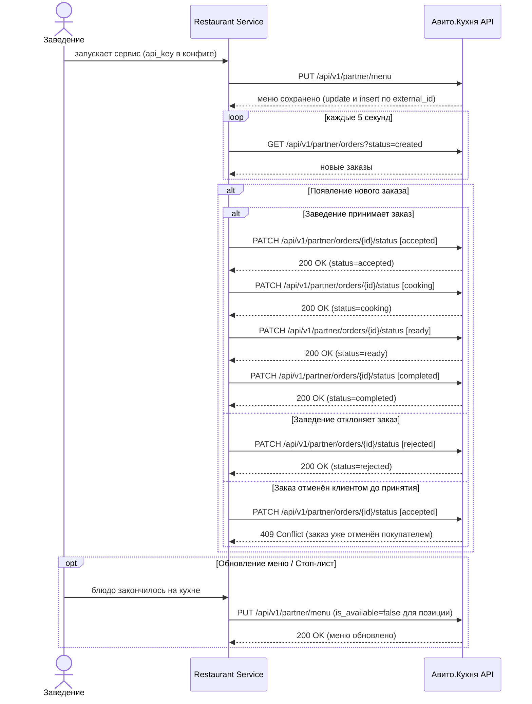

# CJM заведения

## Путь заведения

```mermaid
sequenceDiagram
    actor R as Заведение
    participant RS as Restaurant Service
    participant A as Авито.Кухня API

    R->>RS: запускает сервис (api_key в конфиге)
    RS->>A: PUT /api/v1/partner/menu
    A-->>RS: меню сохранено (update и insert по external_id)

    loop каждые 5 секунд
        RS->>A: GET /api/v1/partner/orders?status=created
        A-->>RS: новые заказы
    end

    alt Появление нового заказа
        alt Заведение принимает заказ
            RS->>A: PATCH /api/v1/partner/orders/{id}/status [accepted]
            A-->>RS: 200 OK (status=accepted)
            RS->>A: PATCH /api/v1/partner/orders/{id}/status [cooking]
            A-->>RS: 200 OK (status=cooking)
            RS->>A: PATCH /api/v1/partner/orders/{id}/status [ready]
            A-->>RS: 200 OK (status=ready)
            RS->>A: PATCH /api/v1/partner/orders/{id}/status [completed]
            A-->>RS: 200 OK (status=completed)
        else Заведение отклоняет заказ
            RS->>A: PATCH /api/v1/partner/orders/{id}/status [rejected]
            A-->>RS: 200 OK (status=rejected)
        else Заказ отменён клиентом до принятия
            RS->>A: PATCH /api/v1/partner/orders/{id}/status [accepted]
            A-->>RS: 409 Conflict (заказ уже отменён покупателем)
        end
    end

    opt Обновление меню / Стоп-лист
        R->>RS: блюдо закончилось на кухне
        RS->>A: PUT /api/v1/partner/menu (is_available=false для позиции)
        A-->>RS: 200 OK (меню обновлено)
    end
```
