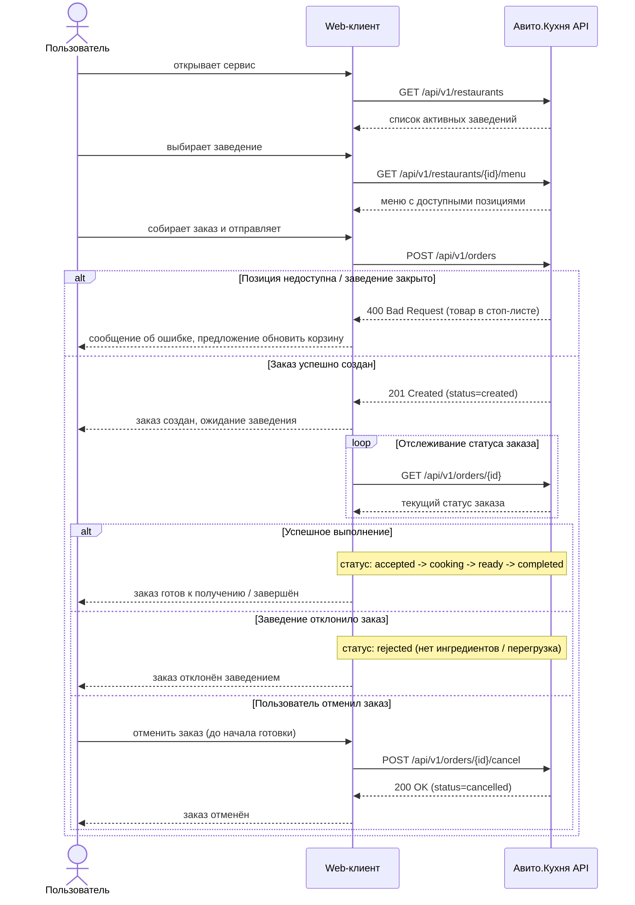

# CJM пользователя

## Путь пользователя

```mermaid
sequenceDiagram
    actor U as Пользователь
    participant C as Web-клиент
    participant A as Авито.Кухня API

    U->>C: открывает сервис
    C->>A: GET /api/v1/restaurants
    A-->>C: список активных заведений

    U->>C: выбирает заведение
    C->>A: GET /api/v1/restaurants/{id}/menu
    A-->>C: меню с доступными позициями

    U->>C: собирает заказ и отправляет
    C->>A: POST /api/v1/orders

    alt Позиция недоступна / заведение закрыто
        A-->>C: 400 Bad Request (товар в стоп-листе)
        C-->>U: сообщение об ошибке, предложение обновить корзину
    else Заказ успешно создан
        A-->>C: 201 Created (status=created)
        C-->>U: заказ создан, ожидание заведения

        loop Отслеживание статуса заказа
            C->>A: GET /api/v1/orders/{id}
            A-->>C: текущий статус заказа
        end

        alt Успешное выполнение
            Note over A,C: статус: accepted -> cooking -> ready -> completed
            C-->>U: заказ готов к получению / завершён
        else Заведение отклонило заказ
            Note over A,C: статус: rejected (нет ингредиентов / перегрузка)
            C-->>U: заказ отклонён заведением
        else Пользователь отменил заказ
            U->>C: отменить заказ (до начала готовки)
            C->>A: POST /api/v1/orders/{id}/cancel
            A-->>C: 200 OK (status=cancelled)
            C-->>U: заказ отменён
        end
    end
```
