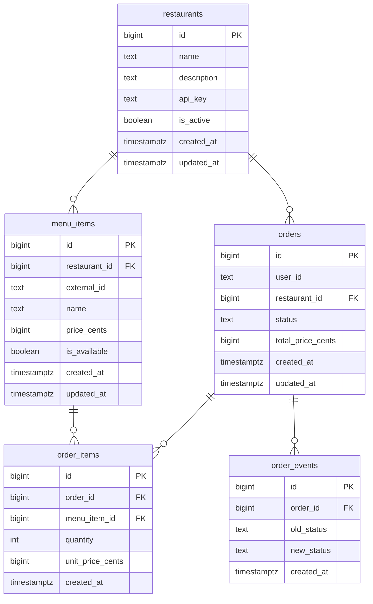

## Схема БД

```mermaid
erDiagram
    restaurants ||--o{ menu_items : ""
    restaurants ||--o{ orders : ""
    orders ||--o{ order_items : ""
    menu_items ||--o{ order_items : ""
    orders ||--o{ order_events : ""

    restaurants {
        bigint id PK
        text name
        text description
        text api_key
        boolean is_active
        timestamptz created_at
        timestamptz updated_at
    }
    menu_items {
        bigint id PK
        bigint restaurant_id FK
        text external_id
        text name
        bigint price_cents
        boolean is_available
        timestamptz created_at
        timestamptz updated_at
    }
    orders {
        bigint id PK
        text user_id
        bigint restaurant_id FK
        text status
        bigint total_price_cents
        timestamptz created_at
        timestamptz updated_at
    }
    order_items {
        bigint id PK
        bigint order_id FK
        bigint menu_item_id FK
        int quantity
        bigint unit_price_cents
        timestamptz created_at
    }
    order_events {
        bigint id PK
        bigint order_id FK
        text old_status
        text new_status
        timestamptz created_at
    }
```
